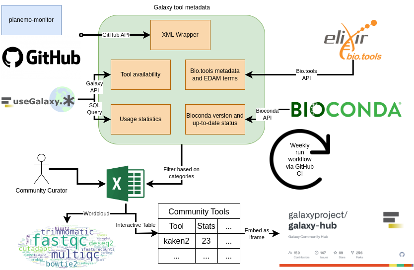

Galaxy Tool Metadata Extractor
=====================

# What is the tool doing?




This tool automatically collects a table of all available Galaxy tools including their metadata. Therefore, various sources are parsed to collect the metadata, such as:
* github (parsing each tool wrapper)
* bio.tools
* bioconda
* Galaxy instances (availability, statistics)

The created table can be filtered to only show the tools relevant for a specific community. 

Any Galaxy community can be added to this project and benefit from a dedicated interactive table that can be embedded into subdomains and website via an iframe. **Learn [how to add your community](https://training.galaxyproject.org/training-material//topics/dev/tutorials/community-tool-table/tutorial.html) in the dedicated GTN toturial**. 

The interactive table benefits from EDAM annotations of the tools, this requires, that the tools are annotation via bio.tools.
**Learn [how to improve metadata for Galaxy tools using the bio.tools registry](https://training.galaxyproject.org/training-material//topics/dev/tutorials/tool-annotation/tutorial.html)**.

# Tool workflows

The tool performs the following steps:

- Parse tool GitHub repository from [Planemo monitor listed](https://github.com/galaxyproject/planemo-monitor)
- Check in each repo, their `.shed.yaml` file and filter for categories, such as metagenomics 
- Extract metadata from the `.shed.yaml`
- Extract the requirements in the macros or xml to get version supported in Galaxy
- Check available against conda version
- Extract bio.tools information if available in the macros or xml
- Check available on the 3 main galaxy instances (usegalaxy.eu, usegalaxy.org, usegalaxy.org.au)
- Get usage statistics form usegalaxy.eu
- Creates an interactive table for all tools: [All tools](https://galaxyproject.github.io/galaxy_tool_metadata_extractor/)
- Creates an interactive table for all registered communities, e.g. [microGalaxy](https://galaxyproject.github.io/galaxy_tool_metadata_extractor/microgalaxy/)

# Usage

## Prepare environment

- Install virtualenv (if not already there)

    ```
    $ python3 -m pip install --user virtualenv
    ```

- Create virtual environment

    ```
    $ python3 -m venv env
    ```

- Activate virtual environment

    ```
    $ source env/bin/activate
    ```

- Install requirements

    ```
    $ python3 -m pip install -r requirements.txt
    ```

## Tools

### Extract all tools

1. Get an API key ([personal token](https://docs.github.com/en/authentication/keeping-your-account-and-data-secure/managing-your-personal-access-tokens)) for GitHub
2. Export the GitHub API key as an environment variable:

    ```
    $ export GITHUB_API_KEY=<your GitHub API key>
    ```

3. Run the script

    ```
    $ python bin/extract_all_tools.sh
    ```

The script will generate a TSV file with each tool found in the list of GitHub repositories and metadata for these tools:

1. Galaxy wrapper id
2. Description
3. bio.tool id
4. bio.tool name
5. bio.tool description
6. EDAM operation
7. EDAM topic
8. Status
9. Source
10. ToolShed categories
11. ToolShed id
12. Galaxy wrapper owner
13. Galaxy wrapper source
14. Galaxy wrapper version
15. Conda id
16. Conda version

### Filter tools based on their categories in the ToolShed

1. Run the extraction as explained before
2. (Optional) Create a text file with ToolShed categories for which tools need to be extracted: 1 ToolShed category per row ([example for microbial data analysis](data/microgalaxy/categories))
3. (Optional) Create a TSV (tabular) file with tool status (1 tool suite per row) as 3 columns:
    - ToolShed ids of tool suites (one per line)
    - Boolean with True to keep and False to exclude
    - Boolean with True if deprecated and False if not

    [Example for microbial data analysis](data/microgalaxy/tools_to_keep_exclude.tsv)
    
4. Run the tool extractor script

    ```
    $ python bin/extract_galaxy_tools.py \
        filter \
        --all <Path to JSON file with all extracted tools> \
        --ts-filtered <Path to output TSV with tools filtered based on ToolShed category>
        --filtered <Path to output TSV with filtered tools based on ToolShed category and manual curation> \
        [--categories <Path to ToolShed category file>] \
        [--status <Path to a TSV file with tool status - 3 columns: ToolShed ids of tool suites, Boolean with True to keep and False to exclude, Boolean with True if deprecated and False if not>]
    ```

## Training

### Extract tutorials from GTN

1. Get an API key ([personal token](https://docs.github.com/en/authentication/keeping-your-account-and-data-secure/managing-your-personal-access-tokens)) for Plausible
2. Export the Plausible API key as an environment variable:

    ```
    $ export PLAUSIBLE_API_KEY=<your GitHub API key>
    ```

3. Run the script

    ```
    $ python bin/extract_all_tutorials.sh
    ```

### Filter tutorials based on tags

1. Run the extraction as explained before
2. Create a file named `tutorial_tags` in your community `data` folder with the list of tutorial tags to keep
3. Run the following command

    ```
    $ python bin/extract_gtn_tutorials.py \
        filter\
        --all "results/all_tutorials.json" \
        --filtered "results/<your community>/tutorials.tsv" \
        --tags "data/communities/<your community>/tutorial_tags"
    ```

## Development

### Tools

To make a test run of the tool to check its functionalities follow [Usage](#Usage) to set-up the environnement and the API key, then run

1. Tool extraction

    ```bash
    $ bash bin/extract_all_tools.sh test
    ```

    This runs the tool, but only parses the test repository [Galaxy-Tool-Metadata-Extractor-Test-Wrapper](https://github.com/paulzierep/Galaxy-Tool-Metadata-Extractor-Test-Wrapper)

2. Tool filter

    ```bash
    $ bash bin/get_community_tools.sh test
    ```

3. Create interactive table and wordcloud
        
    ```bash
    $ bash bin/format_tools.sh
    ```

### Tutorials

1. Tutorial extraction

    ```bash
    $ bash bin/extract_all_tutorials.sh test 
    ```

2. Tutorial filtering

    ```bash
    $ bash bin/get_community_tutorials.sh test
    ```

