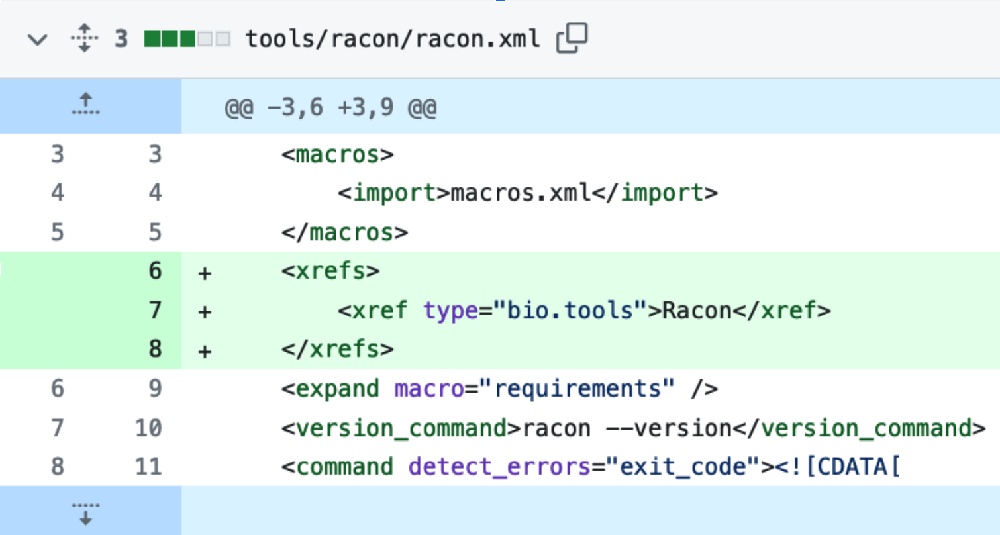

# Introduction or Background

Galaxy [@citesAsAuthority:10.1093/nar/gkac247] is a web-based analysis platform offering almost 10,000 different tools, which are developed in various GitHub repositories.  
Furthermore, the Galaxy community embraces granular implementation of software tools as sub-modules. 
In practice, this means that tool suites are separated into sets of Galaxy tools, also known as Galaxy wrappers, that contain the functionality of a corresponding sub-component.
Some key examples of tool suites include [QIIME 2](https://bio.tools/qiime2) [@citesAsAuthority:Bolyen2019] and [OpenMS](https://bio.tools/openms) [@citesAsAuthority:rost2016openms], which translate to tens and even hundreds of Galaxy tools. 
While granularity supports the composability of tools into diverse purpose-specific workflows, this decentralised development and modular architecture can make it difficult for Galaxy users to find and use tools. 
It may also result in Galaxy tool-wrapper developers duplicating efforts by simultaneously wrapping the same software. 
This is further complicated by the scarcity of tool metadata, which prevents filtering of tools as relevant for a specific scientific community or domain, and makes it impossible to employ advanced filtering by ontology terms like the ones from EDAM [@citesAsAuthority:black2021edam]. 
The final challenge is also an opportunity: the global and cross-domain nature of Galaxy means that it is a big community. 
Solving the visibility of tools across this "ecosystem", and the resulting benefits, are far-reaching for the global collaborative development of data-analysis tools and workflows.

To provide the scientific community with a comprehensive list of annotated Galaxy tools, 
we developed a pipeline at the [ELIXIR BioHackathon Europe 2023](https://2023.biohackathon-europe.org) that collects Galaxy wrappers from a list of GitHub repositories and automatically extracts their metadata (including Conda version [@citesAsAuthority:conda], bio.tools identifier [@citesAsAuthority:biotoolsSchema][@usesDataFrom:Ison2019], BIII identifier [@citesAsAuthority:bioimageWorkflows], and EDAM annotations). 
The workflow also queries the availability of the tools from the three main Galaxy servers (usegalaxy.*) as well as usage statistics from [usegalaxy.eu](https://usegalaxy.eu) (Note: the other main Galaxy servers, [usegalaxy.org](https://usagalaxy.org) and [usegalaxy.org.au](https://usagalaxy.org.au), will be queried for usage statistics in coming updates). 

Crucially, the pipeline can filter its inputs to only include tools that are relevant to a specific research community. 
Based on the selected filters, a community-specific interactive table is generated that can be embedded, e.g. into the respective [Galaxy Hub](https://galaxyproject.org/) webpage or [Galaxy subdomain](https://galaxyproject.org/eu/subdomains/). 
This table allows further filtering and searching for fine-grained tool selection. 
The pipeline is fully automated and executes weekly. 
Any scientific community can apply the pipeline to create a table specific to their needs.

An interactive table that presents metadata is only as useful as the metadata annotations it is capturing. 
To improve the metadata coverage for the interactive table, the project also directly addressed the quality of tool annotations in bio.tools for the [microGalaxy community](https://galaxyproject.org/community/sig/microbial/): 
a community with a focus on tools related to microbial research. 

Annotation guidelines were established for this purpose, the process of updating Galaxy tool wrappers to include bio.tools identifiers was started and the outcome of these activities was evaluated using a crowdsourced approach. During the BioHackathon Europe 2023 week, the annotation practices were applied to the tools selected from the microGalaxy community. 
This effort allowed the team to connect more than 50 tools to their respective bio.tools entry, update the registry entry, and collectively peer-review the results. 

The established pipeline and the annotation guidelines can support any scientific community to make their Galaxy tools more findable, visible, comparable, understandable, and accessible. 
Here, we describe the methods and processes that resulted from this project and highlight how this will now allow the microGalaxy community to confidently navigate an ever-expanding landscape of research software in the Galaxy framework.

# Methods

## Domain-specific interactive tools table

To create the domain-specific interactive tools table, Galaxy tool-wrapper suites are first parsed from across multiple GitHub repositories. 
In effect, the repositories monitored by the planemo-monitor [@citesAsAuthority:Bray2022.03.13.483965] are scraped using a custom script. 
The planemo-monitor is part of the Galaxy tool-update infrastructure and keeps track of the most up-to-date tool development repositories.

Metadata is extracted from each parsed tool-wrapper suite. 
This includes wrapper suite ID, scientific category, Bioconda dependency, and a repository URL from bio.tools. 
As a tool suite can be composed of multiple individual tools, the tool IDs for each tool are also extracted.
The bio.tools reference is used to request metadata annotations via the bio.tools API, including bio.tools description and functionality annotation using EDAM ontology concepts [@usesDataFrom:black2021edam]. 
The latest Conda package version is retrieved via the Bioconda API and compared to the Galaxy tool version to determine the tool’s update state (i.e. to update, or no update required). 

The Galaxy API is used to query if each tool is installed on one of the three UseGalaxy servers ([usegalaxy.eu](https://usegalaxy.eu/), [usegalaxy.org](https://usegalaxy.org/), [usegalaxy.org.au](https://usegalaxy.org.au/)). Furthermore, the tool usage statistics can be retrieved from an SQL query that needs to be executed by Galaxy administrators. 
The query used in the current implementation shows the overall tool usage as well as how many users executed a tool in the last 2 years on the European server ([usegalaxy.eu](https://usegalaxy.eu/)). 

The output of the pipeline is a table that combines Galaxy wrappers with their metadata. 
The complete table can then be filtered to include only tools with relevance for specific communities. 
The initial filtering step is based on the scientific category, which is defined for every Galaxy tool wrapper. 
These categories are high-level and cannot distinguish between specific tool functions. 
However, they allow for the isolation of a subgroup of the initial table for further curation. 
The filtered table can then be manually curated by community curators. 
This curation step involves annotating which of the extracted tools should be kept in the final table. 
Curators can use the EDAM annotations and tool descriptions to assist with this curation step. 
The `to keep` labels for each tool are stored to reduce the replication of effort even further. 
The practical outcome is that for repeat executions of the workflow, only new tools require curation. 

The curated tools are transformed into an interactive web table using the data tables framework[@datatables]. 
The table is hosted on GitHub and deployed via GitHub pages for each community. 
This implementation enables complex queries and filtering without the need for a database backend. 
The table can be embedded in any website via an iframe: examples include the Galaxy community [Hub page for microGalaxy](https://galaxyproject.org/community/sig/microbial#tools) or the [microGalaxy subdomain](https://microgalaxy.usegalaxy.eu/). 
Furthermore, a word cloud based on the usage statistics of the tools is created. 

The workflow is run weekly via GitHub Actions continuous integration, providing an up-to-date table for each community. 
The usage of an iframe enables updates for the table to propagate automatically to any website where it is deployed. 

Any Galaxy community can use the pipeline by adding a folder in the [project GitHub repository](https://github.com/galaxyproject/galaxy_tool_extractor/). 
To initialise the pipeline for a new community you need to add a new subfolder of `data/communities/` , and inside it add a file called 'categories' with a list of Galaxy ToolShed [@citesAsAuthority:blankenberg2014dissemination] categories. 
Additionally, tools that should be excluded or included after filtering, can be added to respective files as well. 
A working example of the community configuration files can be found in the folder for the microGalaxy community.

## Annotation workflow

The annotation process begins by selecting a tool from a Galaxy community. 
This step can make use of the interactive table created by the Galaxy tool extractor scripts presented above. 
A curator then needs to visit the development repository of the Galaxy tool wrapper and search the XML file for a bio.tools xref snippet (Figure \ref{xref_snippet}). 

bio.tools is then checked to confirm that a bio.tools identifier does, or does not, exist. 
The reason for this is that even if a bio.tools identifier exists in a tool wrapper, it may not necessarily exist in bio.tools. 
This is an observation based on real-world annotation errors and serves as a useful supporting step to improve Galaxy wrapper annotations and the completeness of the bio.tools registry. 
In addition, if a bio.tools identifier is not included in the wrapper, this does not mean that there is not a bio.tools identifier available in the registry.

There are then two curation paths to choose from, depending on whether a bio.tools identifier exists in the XML wrapper. In both cases, if no bio.tools entry exists, a new entry should be created and updated using the bio.tools wizard. The creation and update of an entry includes adding concepts from the EDAM ontology. This annotation process can be simplified through the use of [EDAM Browser](https://edamontology.github.io/edam-browser/) [@citesAsAuthority:edamBrowser][@citesAsAuthority:edamBrowserCode].

In the case where no bio.tools identifier exists in the Galaxy XML wrapper, the development repository needs to be forked and a new branch created. 
A new xref snippet can then be added, and a pull request opened against the original repository.

Figure \ref{annotation_workflow} shows a step-by-step breakdown of the above process.

![Step-by-step workflow for systematically improving metadata annotations across bio.tools registry entries and Galaxy tool wrappers. After selecting a Galaxy tool and checking for the presence of a bio.tools ID in its XML file, a curator needs to review bio.tools, create a new bio.tools entry (if needed), and then ensure that both this entry and the Galaxy tool XML file are up-to-date. Updating bio.tools makes use of the registry wizard, and updating a Galaxy tool wrapper to include a bio.tools xref snippet requires a pull request against the development repository. \label{annotation_workflow}](./annotation.png)

# Outcomes and results

There were multiple concrete outcomes from this BioHackathon project, including the ability to create interactive Galaxy tools tables as needed for scientific communities, a process for updating bio.tools, in-development Galaxy Training Network (GTN) tutorials [@citesAsAuthority:batut_community-driven_2018] describing this process, and an update to the [Galaxy IUC](https://galaxyproject.org/iuc/) tool wrapping [standards](https://galaxy-iuc-standards.readthedocs.io/en/latest/index.html). 
These are described in more detail below.

## Prototype interactive table for Galaxy communities

The described workflow for the Galaxy tool metadata extractor (see Figure \ref{metadata_extractor_pipeline}) was successfully implemented ([GitHub repository](https://github.com/galaxyproject/galaxy_tool_extractor)) and could extract more than 1,300 Galaxy tool suites (see the [GitHub repository pages](https://galaxyproject.github.io/galaxy_tool_metadata_extractor) for an up-to-date table).
Of those tool suites, only 267 had a bio.tools identifier, which highlights the importance of performing the annotation process in parallel and complementing the tools with additional metadata. 
An example view of the created interactive table is shown in Figure \ref{web_table}. 
As mentioned above, the filtered table for the microGalaxy community has already been embedded in the [Hub page for microGalaxy](https://galaxyproject.org/community/sig/microbial#tools), as well as the dedicated [microGalaxy subdomain](https://microgalaxy.usegalaxy.eu/). 
The process for creating a new interactive table for a community is currently being transformed into a GTN tutorial.

## bio.tools and EDAM annotations for microGalaxy community

During the week of the BioHackathon, the microGalaxy community executed the annotation workflow as described in the Methods section (see also Figure \ref{annotation_workflow}). 
The initial filtered tool table of the microGalaxy included 218 tool suites, of which 61 had corresponding bio.tools identifiers. 
The progress of the work was tracked using a GitHub project board. 
After the annotation process, the number of tools with bio.tools annotations was increased to 107. 
The added annotations for each respective bio.tools entry were also collectively reviewed by the team. 
A rerun of the Galaxy tool metadata extractor pipeline collected the additional information, and the metadata is now included in the interactive microGalaxy tool table. 

## Training materials and updates to standards

To provide the Galaxy research communities with simple and straightforward guide to annotating their respective tool stacks, the described work has been converted into two GTN tutorials:

- [Adding and updating best practice metadata for Galaxy tools using the bio.tools registry](https://gxy.io/GTN:T00421) [@citesAsAuthority:dev_tool_annotation]
- [Creation of an interactive Galaxy tools table for your community](https://training.galaxyproject.org/training-material/topics/dev/tutorials/community-tool-table/tutorial.html) [@citesAsAuthority:dev_community_tool_table]

The guidelines created were also used to update the [best practices for creating Galaxy tools of the IUC repository](https://galaxy-iuc-standards.readthedocs.io/en/latest/best_practices/tool_xml.html).

# Conclusion and outlook

The project was able to successfully meet its aim of creating reusable prototypes and processes that make the richness of the Galaxy tools ecosystem more discoverable and understandable.
Central to this work was the Galaxy tool metadata extractor pipeline, which is currently generating comprehensive and interactive tabular summaries of Galaxy tools for the [microbial data](https://galaxyproject.org/community/sig/microbial/) and [image analysis](https://galaxyproject.org/use/imaging/) communities within Galaxy (with EU BioHackathon 2023 [Project 16](https://github.com/elixir-europe/biohackathon-projects-2023/tree/main/16)). The metadata extractor can be reused by any Galaxy group or community. For example, the [biodiversity and ecology](https://galaxyproject.org/use/ecology/) community will employ this pipeline in the near future [@citesAsAuthority:elixirBiodiversity].
The generated tabular tool summary provides valuable information that extends beyond the use case of listing community tools. Therefore, an integration with the [Research Software Ecosystem (RSEc)](https://github.com/research-software-ecosystem/content) [@citesAsAuthority:RSEc] is currently being worked on.
Various updates of the Galaxy tool metadata extractor pipeline are also envisioned, such as the integration of comprehensive usage statistics for all large Galaxy servers, additional bio.tools metadata, and a user-friendly integration of manual curation steps.

A set of updates to standards and processes was also created. 
These will support the ongoing growth of the metadata hosted by the interactive tables: primarily by helping communities to maintain and extend the annotations of Galaxy tool wrappers, and the bio.tools ecosystem on which these wrapper annotations depend.

# Acknowledgements

This work was developed as part of BioHackathon Europe 2023.
This work was supported by [ELIXIR](https://elixir-europe.org), the research infrastructure for life science data.
This work was supported by the Australian BioCommons which is enabled by NCRIS via Bioplatforms Australia funding.

# References

