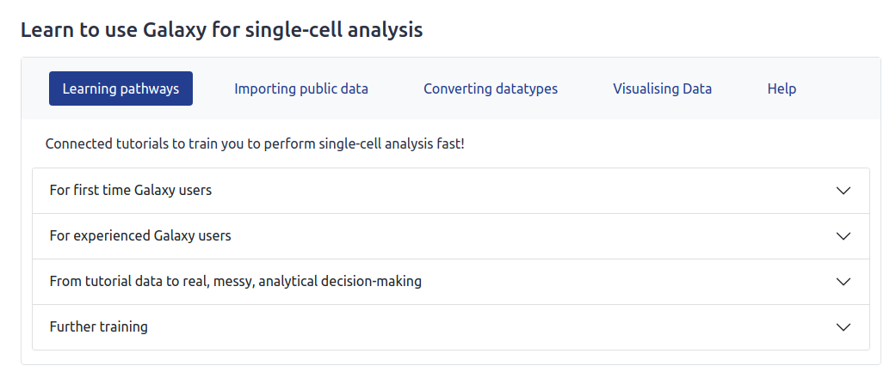
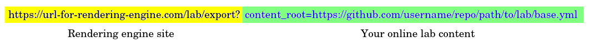
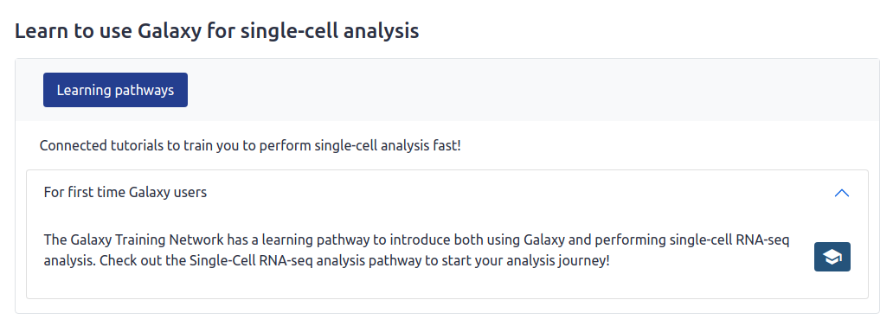

Galaxy Codex
============

Galaxy Communities Dock aka Galaxy Codex is a catalog of Galaxy resources (tools, training, workflows) that can be filtered for any community.

This repository stores the sources to build this catalog. The catalog is automatically updated every week.

Any Galaxy community can be added to this project and benefit from the dedicated resources, including interactive tables that can be embedded into subdomains and website via an iframe. **Learn [how to add your community](https://training.galaxyproject.org/training-material//topics/dev/tutorials/community-tool-table/tutorial.html) in the dedicated GTN toturial**. 

# Prepare environment

- Install virtualenv (if not already there)

    ```
    $ python3 -m pip install --user virtualenv
    ```

- Create virtual environment

    ```
    $ python3 -m venv env
    ```

- Activate virtual environment

    ```
    $ source env/bin/activate
    ```

- Install requirements

    ```
    $ python3 -m pip install -r requirements.txt
    ```

# Extract Galaxy Tool Suites


This tool automatically collects a table of all available Galaxy tool suites including their metadata. Therefore, various sources are parsed to collect the metadata, such as:
* GitHub (parsing each tool wrapper)
* bio.tools
* Bioconda
* Galaxy server (availability, statistics)

The created table can be filtered to only show the tools relevant for a specific community. 

The tool table benefits from EDAM annotations of the tools, this requires, that the tools are annotation via bio.tools.
**Learn [how to improve metadata for Galaxy tools using the bio.tools registry](https://training.galaxyproject.org/training-material//topics/dev/tutorials/tool-annotation/tutorial.html)**.

## Extract tool suites and filter per community automatically

A GitHub action performs every week the following steps:

- Extract all tools by
    1. Parsing tool GitHub repository from [Planemo monitor listed](https://github.com/galaxyproject/planemo-monitor)
    2. Checking in each repo, their `.shed.yaml` file and filter for categories, such as metagenomics 
    3. Extracting metadata from the `.shed.yaml`
    4. Extracting the requirements in the macros or xml to get version supported in Galaxy
    5. Checking available against conda version
    6. Extracting bio.tools information if available in the macros or xml
    7. Checking available on the 3 main galaxy instances (usegalaxy.eu, usegalaxy.org, usegalaxy.org.au)
    8. Getting usage statistics form usegalaxy.eu
- Create an interactive table for all tools: [All tools](https://galaxyproject.github.io/galaxy_tool_metadata_extractor/)
- Filter the tool suite per community
- Create an interactive table for all registered communities, e.g. [microGalaxy](https://galaxyproject.github.io/galaxy_tool_metadata_extractor/microgalaxy/)

## Extract all tools outside a GitHub Action

1. Get an API key ([personal token](https://docs.github.com/en/authentication/keeping-your-account-and-data-secure/managing-your-personal-access-tokens)) for GitHub
2. Export the GitHub API key as an environment variable:

    ```
    $ export GITHUB_API_KEY=<your GitHub API key>
    ```

3. Run the script to extract all tools

    ```
    $ bash sources/bin/extract_all_tools.sh
    ```

The script will generate a TSV file with each tool found in the list of GitHub repositories and metadata for these tools:

1. Galaxy wrapper id
2. Description
3. bio.tool id
4. bio.tool name
5. bio.tool description
6. EDAM operation
7. EDAM topic
8. Status
9. Source
10. ToolShed categories
11. ToolShed id
12. Galaxy wrapper owner
13. Galaxy wrapper source
14. Galaxy wrapper version
15. Conda id
16. Conda version

## Filter tools based on their categories in the ToolShed outside a GitHub Action

1. Run the extraction as explained before
2. (Optional) Create a text file with ToolShed categories for which tools need to be extracted: 1 ToolShed category per row ([example for microbial data analysis](data/microgalaxy/categories))
3. (Optional) Create a TSV (tabular) file with tool status (1 tool suite per row) as 3 columns:
    - ToolShed ids of tool suites (one per line)
    - Boolean with True to keep and False to exclude
    - Boolean with True if deprecated and False if not

    [Example for microbial data analysis](data/microgalaxy/tools_to_keep_exclude.tsv)
    
4. Run the tool extractor script

    ```
    $ python sources/bin/extract_galaxy_tools.py \
        filter \
        --all <Path to JSON file with all extracted tools> \
        --ts-filtered <Path to output TSV with tools filtered based on ToolShed category>
        --filtered <Path to output TSV with filtered tools based on ToolShed category and manual curation> \
        [--categories <Path to ToolShed category file>] \
        [--status <Path to a TSV file with tool status - 3 columns: ToolShed ids of tool suites, Boolean with True to keep and False to exclude, Boolean with True if deprecated and False if not>]
    ```

# Training

Materials are extracted from the Galaxy Training Network and extended with information from Plausible (visits), YouTube (views), feedback and tools.

## Extract training material and filter per community automatically

A GitHub action performs every week the following steps:

- Extract all training by
    1. Parsing the GTN API
    2. Adding EDAM operations from the tools used in the tutorial
    3. Adding visit stats using the Plausible API
    4. Adding video view stats using YouTube API
    5. Adding feedback from the GTN API
- Create an interactive table for all tutorials
- Filter the training per community based on tags
- Create an interactive table for all registered communities

## Extract tutorials from GTN outside a GitHub Action

1. Get an API key ([personal token](https://docs.github.com/en/authentication/keeping-your-account-and-data-secure/managing-your-personal-access-tokens)) for Plausible
2. Export the Plausible API key as an environment variable:

    ```
    $ export PLAUSIBLE_API_KEY=<your GitHub API key>
    ```

3. Run the script

    ```
    $ bash sources/bin/extract_all_tutorials.sh
    ```

## Filter tutorials based on tags outside a GitHub Action

1. Run the extraction as explained before
2. Create a file named `tutorial_tags` in your community `data` folder with the list of tutorial tags to keep
3. Run the following command

    ```
    $ python sources/bin/extract_gtn_tutorials.py \
        filter\
        --all "results/all_tutorials.json" \
        --filtered "results/<your community>/tutorials.tsv" \
        --tags "data/communities/<your community>/tutorial_tags"
    ```

## Export

### Generate wordcloud

Example to generate a wordcloud for the Galaxy tool suites with size of names of tool suites depends on the number of tool users in 2022-2023 on usegalaxy.eu:


```bash
$ python sources/bin/create_wordcloud.py \
    --table "results/all_tools.tsv" \
    --name_col "Galaxy wrapper id" \
    --stat_col "No. of tool users (2022-2023) (usegalaxy.eu)" \
    --wordcloud_mask "data/usage_stats/wordcloud_mask.png" \
    --output "results/all_tools_wordcloud.png" \
```

### Create interactive table in HTML

Example to generate an HTML file with an interactive table with microGalaxy tools that should be kept (`True` in `To keep` column)

```bash
$ python sources/bin/create_interactive_table.py \
    --table "results/microgalaxy/tools.tsv" \
    --remove-col "Reviewed" \
    --remove-col "To keep" \
    --filter-col "To keep" \
    --template "data/interactive_table_template.html" \
    --output "results/microgalaxy/index.html"
```

## Development

### Contributing

To contribute to the CoDex Source code:
1. fork the repository,
2. create a branch and add your changes
3. make a pull request to the **dev branch** of the CoDex repository. 

Upon review the maintainer will merge your pull request. 
Automatic tests will run on the dev branch. 

When the tests succeed a maintainer will merge the dev branch into main. Feel free to ping the maintainers to speed up the process.

The reason we are not running the tests directly on the pull request branch is, that this does not allow to access the GitHub secrets, that are required to run the tests.

# Run the unit tests locally

```
cd codex/sources
PYTHONPATH=bin python -m unittest discover -s bin/tests
```

### Tools

To make a test run of the tool to check its functionalities follow [Usage](#Usage) to set-up the environnement and the API key, then run

1. Tool extraction

    ```bash
    $ bash sources/bin/extract_all_tools.sh test
    ```

    This runs the tool, but only parses the test repository [Galaxy-Tool-Metadata-Extractor-Test-Wrapper](https://github.com/paulzierep/Galaxy-Tool-Metadata-Extractor-Test-Wrapper)

2. Tool filter

    ```bash
    $ bash sources/bin/get_community_tools.sh test
    ```

3. Create interactive table and wordcloud
        
    ```bash
    $ bash sources/bin/format_tools.sh
    ```

### Tutorials

1. Tutorial extraction

    ```bash
    $ bash sources/bin/extract_all_tutorials.sh test 
    ```

2. Tutorial filtering

    ```bash
    $ bash sources/bin/get_community_tutorials.sh test
    ```

### Workflows

1. Workflow extraction

    ```bash
    $ bash sources/bin/extract_all_workflows.sh test 
    ```

2. Workflow filtering

    ```bash
    $ bash sources/bin/get_community_workflows.sh test
    ```

# Galaxy Labs framework

## What is a Galaxy Lab?

A subdomain of a Galaxy server which caters to a specific research community.
The Lab may have a custom Welcome Page and tool panel to make it easier for 
users to navigate the platform without the overhead of navigating 1000+ Galaxy
tools.

> The primary goal of a Galaxy Lab should be to steer its users towards
> best-practice tools, workflows and tutorials.

To see an example, check out Galaxy Australia's Genome Lab at
https://genome.usegalaxy.org.au.


## What does the framework do?

It builds a custom Galaxy Lab welcome page from YAML and Markdown/HTML content.

Anyone can build a Lab page using this framework, as long as their content is
accessible online by URL (typically GitHub). This means that you don't need any
web development skills to create a Lab page, though an understanding of HTML
and a flare for design is critical if you want to fine-tune the layout.

Most of the work is in collecting
tools, workflows, tutorials and other resources that you believe would be most
relevant to a user of your Galaxy Lab - expect this to take some time! Labs
don't build themselves. They are a curated brain dump of a domain expert.

The main feature of the labs engine is rendering structure content sections from
`section.yml` files:



It can also render:

- Custom intro, conclusion and footer sections written in Markdown/HTML
- Arbitrary variable defined in `base.yml` (allowing for server-specific
  context)
- A feedback form which posts submissions to a custom email address
- Contributors from a list of GitHub usernames defined in `CONTRIBUTORS` file
- Any other elements you can think to define in Markdown or HTML, like webforms
  or modals (popups).


## How does it work?

Briefly, you put your content somewhere online, ideally on Github.
It needs to have a very specific structure, so take a look at the 
[example lab](https://github.com/usegalaxy-au/galaxy-media-site/tree/dev/webapp/home/labs/simple).
To get started, you can copy this folder to your own GitHub repository and
update the files with content relevant to your lab.

You can then request the webpage like so:



Requesting `base.yml` as above will return the default lab page, but the
convention is to request a `<hostname>.yml` file that extends the `base.yml`
file with server-specific variables, like `site_name`.

Currently the rendering engine is deployed at
https://site.usegalaxy.org.au/lab/export
but this is likely to change in the future when the Labs Engine becomes a
separate service.


## What do I need to know?

Most of the framework can be understood by looking at the
[example lab](https://github.com/usegalaxy-au/galaxy-media-site/tree/dev/webapp/home/labs/simple),
but expect to spend some time understanding the `sections.yml` schema, which
looks something like this:

```yml
# This is a page section
id: beginner
title: Learn to use Galaxy for single-cell analysis
tabs:
  # Here we define a list of tabs for the section
  - id: pathway
    title: Learning pathways
    heading_md: > # Markdown/HTML accepted
      Connected tutorials to train you to perform single-cell analysis fast!
    content:
      # Each of these is a collapsable item - known as an "accordion"
      - title_md: For first time Galaxy users
        description_md: >
          The Galaxy Training Network has a learning pathway to introduce both
          using Galaxy and performing single-cell RNA-seq analysis. Check out the
          Single-Cell RNA-seq analysis pathway to start your analysis journey!
        button_link: https://training.galaxyproject.org/training-material/learning-pathways/intro_single_cell.html
        button_icon: tutorial
        button_tip: Go to learning pathway
```

The above content will create the following section:



In addition to learning the Labs Engine YAML schema, an understanding of the
following is required:

- GitHub
- Markdown
- HTML (optional, for building custom elements)
- CSS (optional, for custom styling)


## Where can I get more info?

The Lab Engine is self-documenting!

You should find everything you need to build a lab page at
https://site.usegalaxy.org.au/lab/export.
