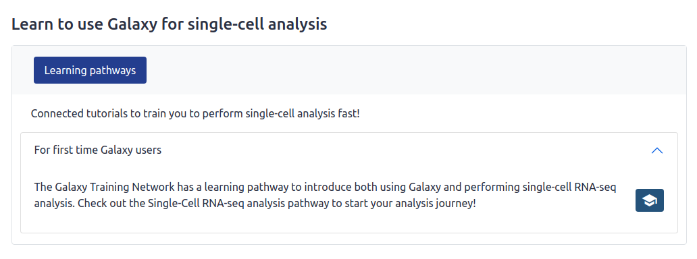

# Galaxy Labs framework

## What is a Galaxy Lab?

A subdomain of a Galaxy server which caters to a specific research community.
The Lab may have a custom Welcome Page and tool panel to make it easier for 
users to navigate the platform without the overhead of navigating 1000+ Galaxy
tools.

> The primary goal of a Galaxy Lab should be to steer its users towards
> best-practice tools, workflows and tutorials.

To see an example, check out Galaxy Australia's Genome Lab at
https://genome.usegalaxy.org.au.


## What does the framework do?

It builds a custom Galaxy Lab welcome page from YAML and Markdown/HTML content.

Anyone can build a Lab page using this framework, as long as their content is
accessible online by URL (typically GitHub). This means that you don't need any
web development skills to create a Lab page, though an understanding of HTML
and a flare for design is critical if you want to fine-tune the layout.

Most of the work is in collecting
tools, workflows, tutorials and other resources that you believe would be most
relevant to a user of your Galaxy Lab - expect this to take some time! Labs
don't build themselves. They are a curated brain dump of a domain expert.

The main feature of the labs engine is rendering structure content sections from
`section.yml` files:


It can also render:

- Custom intro, conclusion and footer sections written in Markdown/HTML
- Arbitrary variable defined in `base.yml` (allowing for server-specific
  context)
- A feedback form which posts submissions to a custom email address
- Contributors from a list of GitHub usernames defined in `CONTRIBUTORS` file
- Any other elements you can think to define in Markdown or HTML, like webforms
  or modals (popups).


## How does it work?

Briefly, you put your content somewhere online, ideally on Github.
It needs to have a very specific structure, so take a look at the 
[example lab](https://github.com/usegalaxy-au/galaxy-media-site/tree/dev/webapp/home/labs/simple).
To get started, you can copy this folder to your own GitHub repository and
update the files with content relevant to your lab.

You can then request the webpage like so:


Requesting `base.yml` as above will return the default lab page, but the
convention is to request a `<hostname>.yml` file that extends the `base.yml`
file with server-specific variables, like `site_name`.

Currently the rendering engine is deployed at
https://site.usegalaxy.org.au/lab/export
but this is likely to change in the future when the Labs Engine becomes a
separate service.


## What do I need to know?

Most of the framework can be understood by looking at the
[example lab](https://github.com/usegalaxy-au/galaxy-media-site/tree/dev/webapp/home/labs/simple),
but expect to spend some time understanding the `sections.yml` schema, which
looks something like this:

```yml
# This is a page section
id: beginner
title: Learn to use Galaxy for single-cell analysis
tabs:
  # Here we define a list of tabs for the section
  - id: pathway
    title: Learning pathways
    heading_md: > # Markdown/HTML accepted
      Connected tutorials to train you to perform single-cell analysis fast!
    content:
      # Each of these is a collapsable item - known as an "accordion"
      - title_md: For first time Galaxy users
        description_md: >
          The Galaxy Training Network has a learning pathway to introduce both
          using Galaxy and performing single-cell RNA-seq analysis. Check out the
          Single-Cell RNA-seq analysis pathway to start your analysis journey!
        button_link: https://training.galaxyproject.org/training-material/learning-pathways/intro_single_cell.html
        button_icon: tutorial
        button_tip: Go to learning pathway
```

The above content will create the following section:



In addition to learning the Labs Engine YAML schema, an understanding of the
following is required:

- GitHub
- Markdown
- HTML (optional, for building custom elements)
- CSS (optional, for custom styling)


## Where can I get more info?

The Lab Engine is self-documenting!

You should find everything you need to build a lab page at
https://site.usegalaxy.org.au/lab/export.
