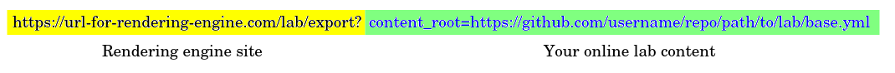

# Galaxy Labs framework

## What is a Galaxy Lab?

A subdomain of a Galaxy server which caters to a specific research community.
The Lab may have a custom Welcome Page and tool panel to make it easier for 
users to navigate the platform without the "bloat" of 1000+ Galaxy tools.

To see an example, check out Galaxy Australia's Genome Lab at
https://genome.usegalaxy.org.au.

## What does the framework do?

It builds a custom Galaxy Lab welcome page from YAML and Markdown/HTML content.

Anyone can build a Lab page using this framework, as long as their content is
accessible online by URL (typically GitHub). This means that you don't need any
web development skills to create a Lab page, though an understanding of HTML is
very useful for tuning the layout.

Most of the work is in collecting
tools, workflows, tutorials and other resources that you believe would be most
relevant to a user of your Galaxy Lab - this does take some time!

The main feature of the labs engine is rendering structure content sections from
`section.yml` files:

It also renders:

- A feedback form which posts submissions to a custom email address
- Custom intro, conclusion and footer sections written in Markdown/HTML
- Arbitrary variable defined in `base.yml`
- Contributors from a list of GitHub usernames defined in `CONTRIBUTORS` file
- Any other elements you can think to define in Markdown or HTML, like webforms
  or modals (popups).

## How does it work?

Briefly, you put your content somewhere online, normally on Github. 
It needs to have a very specific structure, so take a look at the 
[template lab](TODO).

You can then request the webpage like so:

Requesting `base.yml` as above will return the default lab page, but the
convention is to request a `<hostname>.yml` file that extends the `base.yml`
file with server-specific variables, like `site_name`.

Currently the rendering engine is deployed at
https://site.usegalaxy.org.au/lab/export
but this is likely to change in the future when the Labs Engine becomes a
separate service.

## What do I need to know?

In addition to learning the Labs Engine YAML schema, an understanding of the
following is required:

- GitHub
- YAML
- Markdown
- HTML (optional, very useful)

## Where can I get more info?

The Lab Engine is self-documenting. You should find everything you need to
build a lab page at https://site.usegalaxy.org.au/lab/export.
